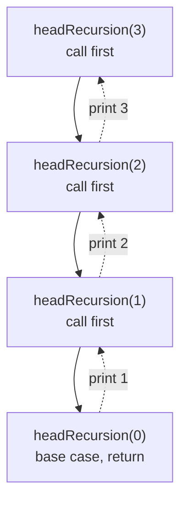
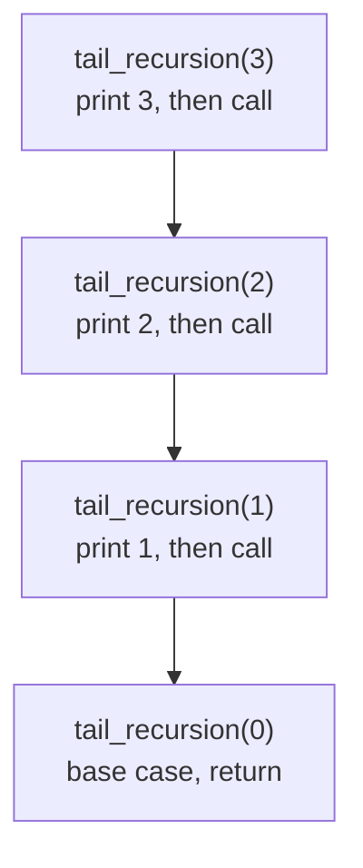

# Understanding Recursion in Data Structures and Algorithms

## Function Overview

A function is a reusable block of code designed to perform a specific task. It can take input (parameters) and may return a result. Functions allow us to break down complex problems into smaller, manageable pieces.

## Recursion

Recursion occurs when a function calls itself directly or indirectly to solve a problem. It is an elegant approach to handle problems that can be broken down into smaller, similar subproblems.

### Infinite Recursion

Infinite recursion happens when a function does not have a base condition to stop the recursive calls. This leads to the function calling itself indefinitely, eventually causing a stack overflow.

```python
# Example: Infinite Recursion in Python
def infinite_recursion():
    print("Calling function")
    infinite_recursion()

# ── Driver ──────────────────────────────────────────────
# Not calling infinite_recursion() here — it has no base case, so it would
# recurse forever and end in a stack overflow. This is exactly why every
# recursive function needs a base case.
print("infinite_recursion() is defined above but deliberately not called — it has no base case.")
```

```java
// Example: Infinite Recursion in Java
class Main {
    static void infiniteRecursion() {
        System.out.println("Calling function");
        infiniteRecursion();
    }

    // ── Driver ──────────────────────────────────────────────
    public static void main(String[] args) {
        // Not calling infiniteRecursion() here — it has no base case, so it
        // would recurse forever and end in a stack overflow. This is exactly
        // why every recursive function needs a base case.
        System.out.println("infiniteRecursion() is defined above but deliberately not called — it has no base case.");
    }
}
```

## Base Case/Condition

The base case is a stopping condition in recursive functions that prevents infinite recursion. It defines the simplest instance of the problem that can be solved without further recursion.

<div style="border-left:4px solid #da5233;background:rgba(218,82,51,0.08);padding:0.6rem 1rem;border-radius:0 0.5rem 0.5rem 0;margin:1.25rem 0">

⚠️ **Note.** Writing effective recursion involves defining a base case or condition that ensures the recursion terminates. Without a base case, recursion will continue indefinitely, leading to stack overflow.

</div>

## Recursive Stack Space

Each time a function calls itself, a new frame is added to the function call stack. The stack keeps track of the current function execution. When a base condition is met, the stack starts unwinding, returning the results in reverse order.

## Program Flow in Recursion

When a recursive function is called, a new instance of that function is created and the control is passed to it until it hits the base case. Each recursive call adds a new frame to the stack. Once the base case is reached, the stack starts unwinding, returning the results step by step.

## Types of Recursion

### Head Recursion

In head recursion, the recursive call occurs before any other processing in the function. The function waits for the recursive call to return before proceeding with any operation.

Example: The following code prints number from 1 to 5 using head recursion.

```java
// Java Example of Head Recursion
class Main {
    static void headRecursion(int n) {
        if (n > 0) {
            headRecursion(n - 1);  // Recursive call before processing
            System.out.print(n + " ");  // Processing after recursion
        }
    }

    // ── Driver ──────────────────────────────────────────────
    public static void main(String[] args) {
        headRecursion(5);
    }
}
```

```python
# Python Example of Head Recursion
def head_recursion(n):
    if n > 0:
        head_recursion(n - 1)  # Recursive call before processing
        print(n, end=" ")  # Processing after recursion

# ── Driver ──────────────────────────────────────────────
head_recursion(5)
```

Below is the recursion tree for `headRecursion(3)` — the calls go all the way down to the base case first, and every `print` happens only on the way back up:



### Tail Recursion

In tail recursion, the recursive call is the last operation in the function. Once the function calls itself, there is no need to retain the current function's state, allowing the compiler to optimize tail recursion.

Example: The following code prints number from 5 to 1 using tail recursion.

```python
# Python Example of Tail Recursion
def tail_recursion(n):
    if n == 0:
        return
    print(n, end=" ")  # Processing before recursion
    tail_recursion(n - 1)  # Recursive call is the last action

# ── Driver ──────────────────────────────────────────────
tail_recursion(5)
```

```java
// Java Example of Tail Recursion
class Main {
    static void tailRecursion(int n) {
        if (n == 0) return;
        System.out.print(n + " ");  // Processing before recursion
        tailRecursion(n - 1);  // Recursive call is the last action
    }

    // ── Driver ──────────────────────────────────────────────
    public static void main(String[] args) {
        tailRecursion(5);
    }
}
```

Below is the recursion tree for `tail_recursion(3)` — each call prints on the way down, before making the next call, so nothing is left to do when the stack unwinds:



## Stack Overflow

Any local machine has a limited resources. Stack overflow occurs when too many recursive calls are made without a base case, or the recursion depth exceeds the system's call stack limit. This causes the program to crash as the system runs out of stack space.

## Recursion Tree

A recursion tree is a visual representation that helps understand the flow of recursive calls. It shows how the problem is divided into smaller subproblems at each recursive step.

- **Recursion Tree for Head Recursion.** In head recursion, the tree grows downward as the function waits for each recursive call to complete before executing the remaining operations.
- **Recursion Tree for Tail Recursion.** In tail recursion, the recursion tree is simpler since each recursive call is the last operation, leading to more straightforward unwinding of the stack.

## Time Complexity

The time complexity of a recursive function is generally based on the number of recursive calls made. If a function makes one recursive call, the time complexity is O(n), where n is the depth of the recursion.

## Space Complexity

The space complexity of a recursive function is determined by the maximum depth of the recursive call stack. If the function reaches a maximum recursion depth of n, the space complexity is O(n).

## Parameterized Recursion

In basic recursion, global variables or implicit logic are sometimes used to control the recursion state. Parameterized recursion involves passing all required information as parameters to the recursive function. This approach results in:

- Better control over recursion flow
- Cleaner and more maintainable code
- Independence from external or global state

Now, let's understand parameterized recursion with the help of a few examples.

### Example 1: Print Value X, N Times

Problem: Given two numbers X and N, print the value X exactly N times using recursion.

#### Recursive Approach With Parameters

```python
def print_x_n_times(x, n):
    if n == 0:
        return  # base case
    print(x, end=" ")  # print the value
    print_x_n_times(x, n - 1)  # recursive call with reduced n

# ── Driver ──────────────────────────────────────────────
if __name__ == "__main__":
    x = 4
    n = 5

    # Printing X, N number of times
    print_x_n_times(x, n)
```

```java
class Main {
    static void printXNTimes(int x, int n) {
        if (n == 0) return;      // base case
        System.out.print(x + " "); // print the value
        printXNTimes(x, n - 1);  // recursive call with reduced n
    }

    // ── Driver ──────────────────────────────────────────────
    public static void main(String[] args) {
        int x = 4, n = 5;

        // Printing X, N number of times
        printXNTimes(x, n);
    }
}
```

Explanation: Each recursive call prints the value x once and decreases n by 1 until n reaches zero, which terminates recursion.

### Example 2: Print Numbers from 1 to N

Problem: Given a number N, print all the numbers from 1 to N.

To solve this problem, both head and tail recursion work.

#### Head Recursion (Work Happens After Recursion)

```python
# Recursive function to print numbers from 1 to N
def print1ToN(n):
    if n == 0:
        return
    print1ToN(n - 1)           # recursive call before printing
    print(n, end=" ")          # print after recursion call

# ── Driver ──────────────────────────────────────────────
n = 5

# Printing 1 to N
print1ToN(n)
```

```java
class Main {
    // Recursive function to print numbers from 1 to N
    static void print1ToN(int n) {
        if (n == 0) return;
        print1ToN(n - 1);             // recursive call before printing
        System.out.print(n + " ");    // print after recursion call
    }

    // ── Driver ──────────────────────────────────────────────
    public static void main(String[] args) {
        int n = 5;

        // Printing 1 to N
        print1ToN(n);
    }
}
```

Explanation: Each recursive call decreases the value of N and calls the function recursively with the updated value until it reaches 0. On the return path, each call prints the value N until the first call made is returned.

If we wish to use Tail recursion to print the numbers from 1 to N, then we need to introduce an index parameter i.

### Example 3: Print Numbers from N to 1

Printing the numbers from N to 1 is similar to printing the numbers from 1 to N.

While printing the numbers from 1 to N, head recursion was used (where work happens after the recursion call). This had printed the numbers in the order from 1 to N.

Now, in order to print the numbers from N to 1, tail recursion can be used. In the tail recursion, work (printing the number) happens before the recursion call. This will print the numbers in decreasing order from N to 1.

#### Printing N to 1 (Using Tail Recursion)

```python
# Recursive function to print numbers from N to 1
def printNto1(n):
    if n == 0:
        return
    print(n, end=" ")          # print before recursion call
    printNto1(n - 1)           # recursive call after printing

# ── Driver ──────────────────────────────────────────────
n = 5

# Printing N to 1
printNto1(n)
```

```java
class Main {
    // Recursive function to print numbers from N to 1
    static void printNto1(int n) {
        if (n == 0) return;
        System.out.print(n + " ");    // print before recursion call
        printNto1(n - 1);             // recursive call after printing
    }

    // ── Driver ──────────────────────────────────────────────
    public static void main(String[] args) {
        int n = 5;

        // Printing N to 1
        printNto1(n);
    }
}
```

Explanation: Each recursive call prints the value of N and decreases the value of N by 1 and calls recursively the function with the updated value until it reaches 0. This prints the numbers from N to 1.

If we wish to use Head recursion to print the numbers from N to 1, then we need to introduce an index parameter i.

#### Printing N to 1 (Using Head Recursion)

```java
class Main {
    // Recursive function to print numbers from N to 1
    static void printNto1(int i, int n) {
        if (i > n) return;
        printNto1(i + 1, n);             // recursive call before printing
        System.out.print(i + " ");    // print after recursion call
    }

    // ── Driver ──────────────────────────────────────────────
    public static void main(String[] args) {
        int n = 5;

        // Printing N to 1
        printNto1(1, n);
    }
}
```

```python
# Recursive function to print numbers from N to 1
def printNto1(i, n):
    if i > n:
        return
    printNto1(i+1, n)           # recursive call before printing
    print(i, end=" ")          # print after recursion call

# ── Driver ──────────────────────────────────────────────
n = 5

# Printing N to 1
printNto1(1, n)
```

Explanation: Each recursive call increases the value of i by 1 until i becomes greater than n. On the return trip, each recursive call prints the value of i. This prints all the numbers from N to 1 using Head Recursion.

## Head Recursion vs. Tail Recursion

| Aspect | Head Recursion | Tail Recursion |
| --- | --- | --- |
| Order of Execution | Recursive calls before performing work | Work performed before recursive calls |
| Loop Conversion | Harder to convert directly into a loop | Easily convertible into a loop |
| Compiler Optimization | Generally harder to optimize | Easier to optimize via tail call elimination |
| Typical Use Cases | Tree traversals, backtracking | Loop-like computations, accumulations |
